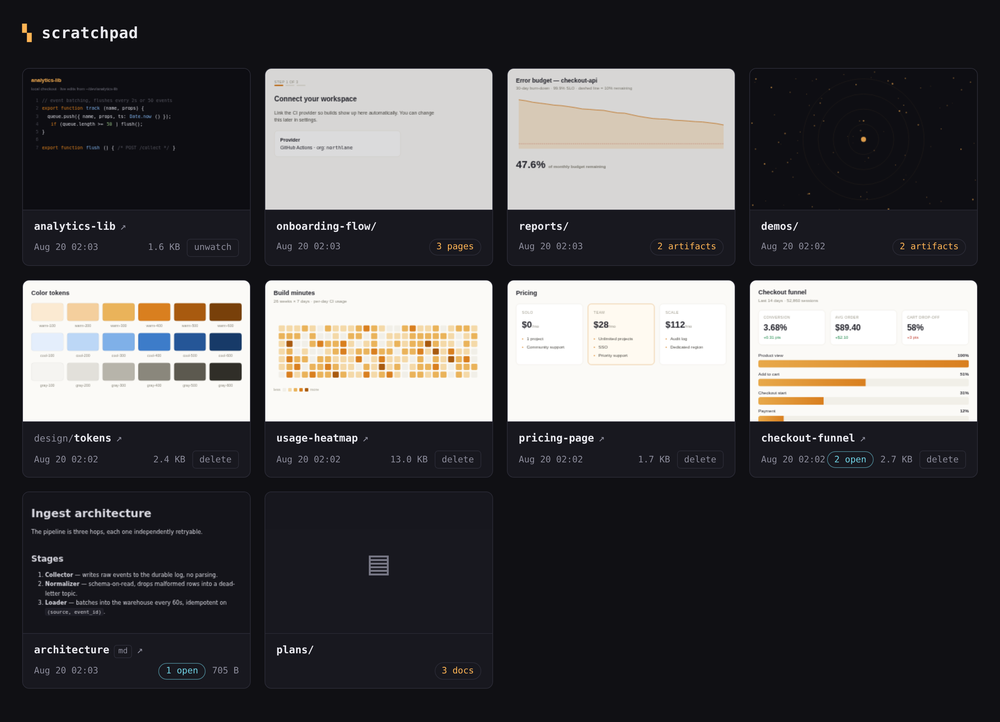
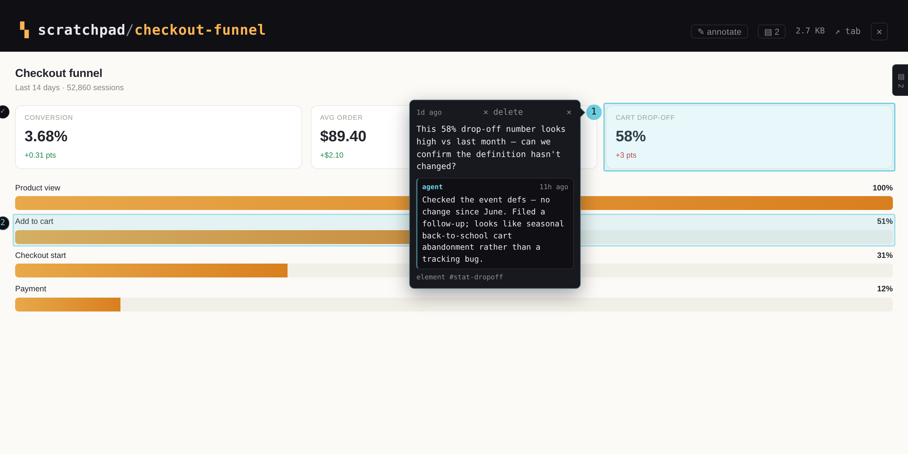

# scratchpad

Self-hosted artifact hosting for coding agents. Agents publish html/css/js
artifacts with the `scratchpad` CLI; every artifact folder under
`~/.scratchpad` (`%USERPROFILE%\.scratchpad` on Windows) is served instantly
on an auto-refreshing htmx site.



```
~/.scratchpad/
├── my-artifact/            # artifact: any folder directly containing *.html
│   ├── index.html          # entry (or first *.html)
│   ├── style.css           # any relative assets: css, js, images, fonts...
│   └── img/logo.png        # ...including subfolders
└── lab/graphs/             # project paths nest arbitrarily deep
    └── pixel/
        └── index.html
```

Project paths nest arbitrarily deep; artifacts don't. The shallowest folder on
a path holding an `.html` is the artifact and its whole subtree is assets — a
subfolder with its own `.html` is served, never listed as an artifact of its
own.

The filesystem is the sole source of truth: anything that writes a folder
there (agents, `cp -r`, this repo's CLI) publishes an artifact. Publishing is
**create-only** — a taken name is an error, never an overwrite — and deleting
is the user's action in the web UI. Markdown is first-class: any `.md`
renders as a styled page, so watching a docs tree gives you a browsable site.

## Run

```bash
make web        # build the image and run the site at http://localhost:8737
make web LAN=1  # explicitly expose the unauthenticated site on the LAN
make stop       # stop it
```

Everything ships in one container image built from `scratch`. The site lists
artifacts newest-first with sandboxed live previews and per-card delete
buttons; an fsnotify watcher streams changes over SSE, so the list refreshes
the moment anything is published. `make install` runs it natively under
`systemd --user` instead — see [docs/internals.md](docs/internals.md).
Both deployments bind loopback by default. `make install LAN=1` is the native
LAN equivalent; LAN mode exposes artifact contents and unauthenticated delete
and notes-write endpoints to every host that can reach port 8737.

On **Windows** there is no container and no WSL — `scratchpad.exe` and
`scratchpad-web.exe` are native binaries, installed and started from
PowerShell without administrator rights:

```powershell
.\scripts\install.ps1 install   # CLI + skill + a per-user logon Scheduled Task
```

Windows support is beta and NTFS-only. See [docs/windows.md](docs/windows.md).

## Connect your agents

```bash
make install-skill   # CLI on PATH + skill for claude/pi
```

An [Agent Skills](https://agentskills.io)-format
[`skill/SKILL.md`](skill/SKILL.md), installed to `~/.claude/skills/` and
`~/.pi/agent/skills/`, teaches agents to `watch` the project's `.scratchpad/`
folder and simply write artifact folders into it, keeping `publish` for
frozen snapshots. Any agent that can run shell commands works the same way —
there is no MCP server, on purpose.

## CLI

```bash
echo '<h1>hi</h1>' | scratchpad publish -name hello -html -
scratchpad publish -project lab/graphs -name chart -dir ./chart-folder
scratchpad watch ./chart-folder     # link instead of copy: edits go live as you save
scratchpad watches                  # every watch link and where it points
scratchpad unwatch lab/graphs/chart # drop the link, keep the folder
scratchpad list [-json]
scratchpad delete -project lab/graphs -name chart
```

## Review notes

The user, reviewing an artifact in the viewer, leaves notes anchored to an
element or a text range. Agents read them back and close the loop — never by
editing or deleting a note, only by fixing the thing and replying:



```bash
scratchpad notes demo/q3-report                # open notes, markdown report
scratchpad notes resolve demo/q3-report/index.html k7f2ac -m "moved the legend above the plot"
```

Resolve is the agent's claim, not acceptance — the user reopens or deletes
the note.

## Docs

- [docs/cli.md](docs/cli.md) — every command, publish vs watch, naming rules
- [docs/notes.md](docs/notes.md) — review notes: lifecycle, storage, HTTP
  API, anchoring
- [docs/ignore-rules.md](docs/ignore-rules.md) — `.scratchpadignore` and what
  is hidden by default
- [docs/windows.md](docs/windows.md) — native Windows: install, startup,
  watch links, supported filesystems, troubleshooting
- [docs/internals.md](docs/internals.md) — layout, security model,
  deployment, env vars
