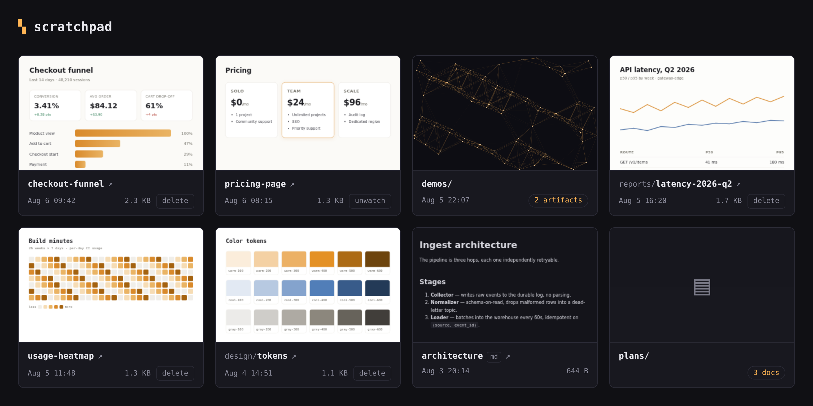

# scratchpad

Self-hosted artifact hosting for coding agents. Agents publish html/css/js
artifacts with the `scratchpad` CLI; every artifact folder under
`~/.scratchpad` is served instantly on an auto-refreshing htmx site.



```
~/.scratchpad/
├── my-artifact/            # artifact: any folder directly containing *.html
│   ├── index.html          # entry (or first *.html)
│   ├── style.css           # any relative assets: css, js, images, fonts...
│   └── img/logo.png        # ...including subfolders
└── lab/graphs/             # project paths nest arbitrarily deep
    └── pixel/
        └── index.html
```

A folder is an **artifact** when it directly contains an `.html` file — its
whole subtree is that artifact's assets. Every folder above it is project path,
each level browsable as its own page. The filesystem is the sole source of
truth, so anything that writes a folder (agents, `cp -r`, this repo's CLI)
publishes an artifact. Publishing is **create-only**: a taken name is an error,
never an overwrite, and deleting is a human action in the web UI.

## Run

```bash
make web        # build the image and run the site at http://localhost:8737
make stop       # stop it
```

Everything ships in one container image built from `scratch`. The site lists
artifacts newest-first with sandboxed live previews and per-card delete
buttons; an fsnotify watcher streams changes over SSE, so the list refreshes
the moment anything is published. `make install` runs it natively under
`systemd --user` instead — see [docs/internals.md](docs/internals.md).

## Connect your agents

```bash
make install-skill   # CLI on PATH + skill for claude/pi
```

`scratchpad` goes on `~/.local/bin`, and an [Agent
Skills](https://agentskills.io)-format [`skill/SKILL.md`](skill/SKILL.md)
teaches agents to build a folder and `publish -dir` it. Installed to
`~/.claude/skills/` and `~/.pi/agent/skills/`; any agent that reads Agent
Skills — or just runs shell commands — works the same way.

There is no MCP server. One existed early on and was removed: it duplicated the
CLI, forced files through a JSON envelope, and split the guardrails across two
places. `make install-skill` also clears registrations left by older installs.

## CLI

```bash
echo '<h1>hi</h1>' | scratchpad publish -name hello -html -
scratchpad publish -project lab/graphs -name chart -dir ./chart-folder
scratchpad watch ./chart-folder     # symlink instead of copy: edits go live as you save
scratchpad watches                  # every watch link and where it points
scratchpad unwatch lab/graphs/chart # drop the link, keep the folder
scratchpad list [-json]
scratchpad delete -project lab/graphs -name chart
```

Full reference, including publish-vs-watch and naming rules:
[docs/cli.md](docs/cli.md).

## Review notes

A human reviewing an artifact in the viewer can leave notes anchored to an
element or a text range. Agents read them back and close the loop — never
by editing or deleting a note, only by fixing the thing and replying:

```bash
scratchpad notes demo/q3-report                # open notes, markdown report
scratchpad notes resolve demo/q3-report/index.html k7f2ac -m "moved the legend above the plot"
```

Resolve is the agent's claim, not acceptance — a human reopens or deletes the
note. Full reference: [docs/notes.md](docs/notes.md).

Markdown is first-class — any `.md` renders as a styled page — so watching a
docs or plans tree gives you a browsable site of mockups and notes.

## More

- [docs/cli.md](docs/cli.md) — every command, publish vs watch, naming rules
- [docs/notes.md](docs/notes.md) — review notes: lifecycle, storage, CLI,
  HTTP API, anchoring
- [docs/ignore-rules.md](docs/ignore-rules.md) — `.scratchpadignore` and what
  is hidden by default
- [docs/internals.md](docs/internals.md) — layout, security model, deployment,
  env vars
